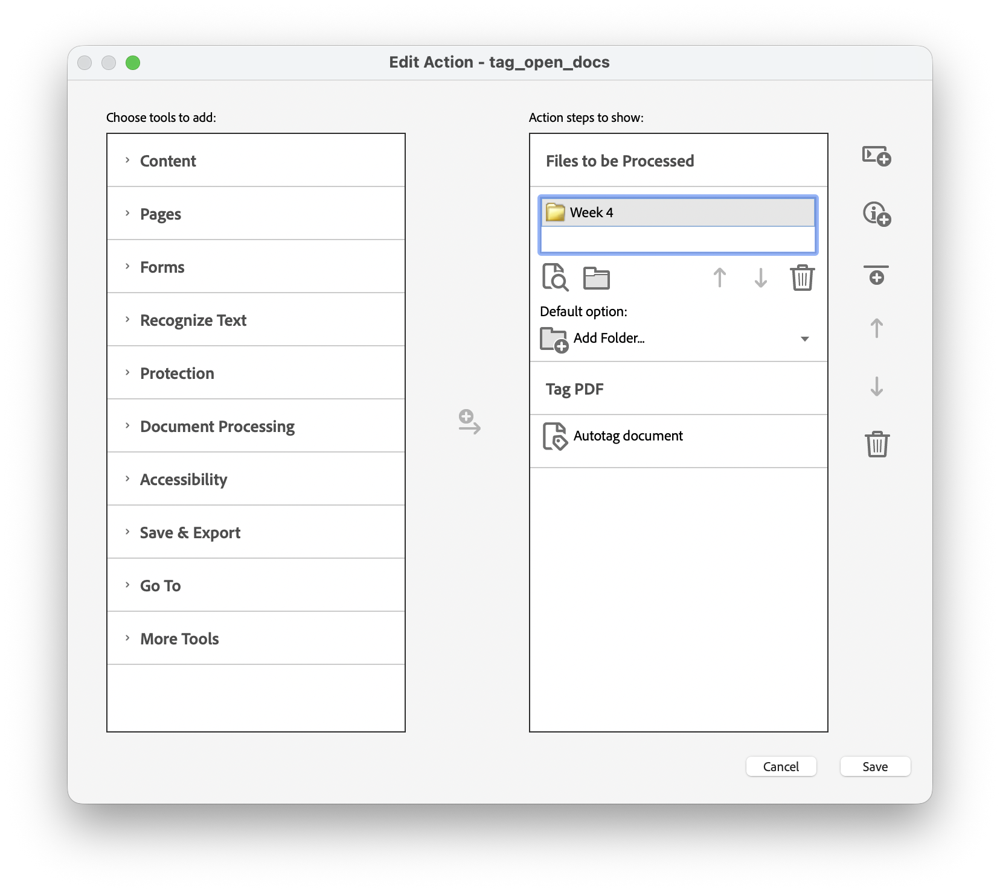
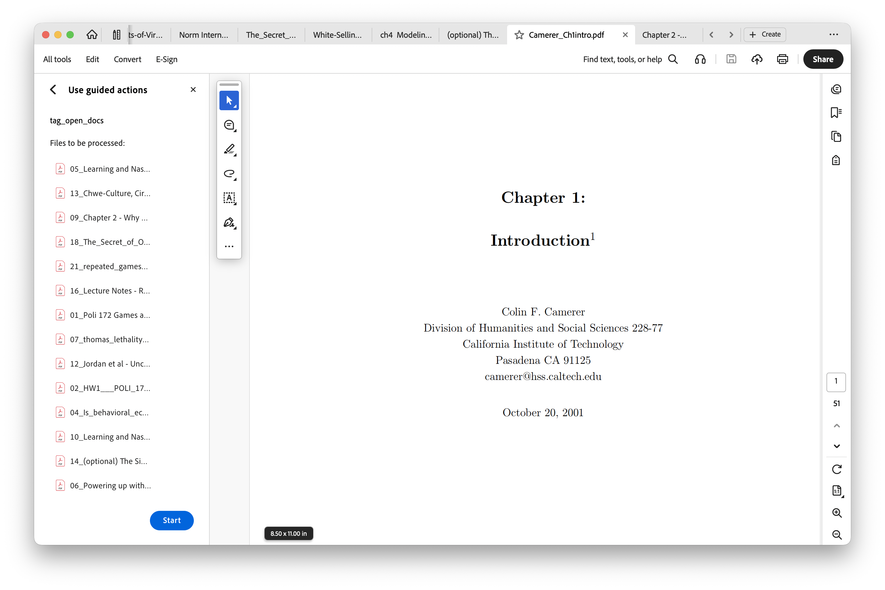

# Batch-Tagging PDFs for Canvas Accessibility with Adobe Acrobat Pro

## The problem

Canvas's accessibility checker flags PDFs that lack "structure tags" --- metadata that labels headings, paragraphs, lists, and other elements for screen readers. Most PDFs generated by LaTeX, Pandoc, or exported from older software lack these tags. Published journal articles and book chapters are also frequently untagged.

This guide covers how to batch-tag PDFs using Adobe Acrobat Pro's Action Wizard, along with a helper script to identify and stage untagged files.

## Prerequisites

- **Adobe Acrobat Pro** (available through most university site licenses)
- **poppler** (for the `pdfinfo` command-line tool): `brew install poppler`
- **qpdf** (for handling permission-locked PDFs): `brew install qpdf`
- A terminal (Terminal.app or any shell)

## Overview

The workflow has three phases:

1. **Identify** untagged PDFs and stage them in a temporary folder
2. **Tag** them using Acrobat Pro's Action Wizard
3. **Copy** the tagged files back to their original locations

Staging files in a temporary folder is necessary because Acrobat's Action Wizard processes every file in a folder, including non-PDFs (Word docs, images, etc.), and there's no built-in file-type filter. The staging step ensures Acrobat only sees the PDFs you want to tag.

## Phase 1: Identify and stage untagged PDFs

### Check a single file

You can check whether any PDF is tagged using `pdfinfo`:

```bash
pdfinfo "path/to/document.pdf" | grep Tagged
```

- `Tagged: yes` --- Canvas will accept this.
- `Tagged: no` --- Canvas will flag it.

### Gather all untagged PDFs into a temp folder

Save the following script as `gather_untagged.sh` (a copy is included in this folder):

```bash
#!/bin/bash
# gather_untagged.sh — collect untagged PDFs into a temp folder for batch tagging
# Usage: ./gather_untagged.sh [source_directory]
# Defaults to current directory. Searches recursively.

dir="${1:-.}"
dest="/tmp/untagged_pdfs"

rm -rf "$dest"
mkdir -p "$dest"

i=1
> "$dest/_mapping.txt"

find "$dir" -name '*.pdf' -print0 | sort -z | while IFS= read -r -d '' pdf; do
  tagged=$(pdfinfo "$pdf" 2>/dev/null | grep 'Tagged' | awk '{print $2}')
  if [ "$tagged" = "no" ]; then
    fullpath="$(cd "$(dirname "$pdf")" && pwd)/$(basename "$pdf")"
    # Numbered prefix avoids name collisions between different folders
    newname=$(printf "%02d" $i)_"$(basename "$pdf")"
    cp "$fullpath" "$dest/$newname"
    echo "$newname|$fullpath" >> "$dest/_mapping.txt"
    echo "  $newname"
    i=$((i + 1))
  fi
done

count=$(wc -l < "$dest/_mapping.txt" | tr -d ' ')
echo ""
echo "Found $count untagged PDF(s) in: $dest"
echo "Open this folder in Acrobat's Action Wizard to tag them."
```

Run it on your course folder:

```bash
chmod +x gather_untagged.sh
./gather_untagged.sh /path/to/your/course_files
```

This creates `/tmp/untagged_pdfs/` containing copies of every untagged PDF, with numbered prefixes to prevent name collisions. It also creates a `_mapping.txt` file that records where each file came from.

To open the temp folder in Finder:

```bash
open /tmp/untagged_pdfs
```

**Important:** Before running the Action Wizard, delete the `_mapping.txt` file from the temp folder (or rename it to `_mapping.txt.bak`), otherwise Acrobat will try to process it too.

## Phase 2: Tag PDFs in Acrobat Pro

### One-time setup: Create a batch tagging action

1. Open **Adobe Acrobat Pro**
2. Go to **All Tools** and search for **"Action Wizard"** (or look for "Use guided actions")
3. Click **New Action**



4. In the **"Choose tools to add"** panel on the left, expand **Accessibility**
5. Click **"Autotag document"** to add it as a step
6. Also expand **Save & Export** and add a **Save** step (so tagged files are saved automatically)
7. In the **"Files to be Processed"** section on the right, change the default option to **"Add Folder..."** and select the `/tmp/untagged_pdfs/` folder
8. Give the action a name (e.g., "Tag PDFs") and click **Save**

### Run the action

1. Select your saved action from the Action Wizard
2. Verify the file list looks correct --- it should show only the numbered PDF files from the temp folder



3. Click **Start**
4. Acrobat will process each file. This typically takes a few seconds per file.

### Troubleshooting

Some PDFs may fail to tag. Common reasons and fixes:

**Scanned/image-only PDFs (e.g., book chapters)**
- Symptom: Acrobat processes the file but it remains untagged, or the autotag option does nothing useful.
- Fix: Run **OCR** first. In Acrobat, go to **Tools** > **Recognize Text** > **In This File**, then try autotagging again.

**Permission-locked PDFs (e.g., some journal articles)**
- Symptom: The "Autotag document" option is greyed out. Document Properties > Security shows "Changing the Document: Not Allowed."
- Fix: Use `qpdf` to strip restrictions, or rebuild the PDF via PostScript:

```bash
# Try qpdf first (preserves quality)
qpdf --decrypt "locked_article.pdf" "unlocked_article.pdf"

# If that doesn't work, rebuild via PostScript (may slightly reduce quality)
pdftops "locked_article.pdf" /tmp/temp.ps
ps2pdf /tmp/temp.ps "unlocked_article.pdf"
```

Then open the unlocked version in Acrobat and autotag it.

## Phase 3: Copy tagged files back

After Acrobat finishes, verify the results:

```bash
# Check how many were successfully tagged
for f in /tmp/untagged_pdfs/*.pdf; do
  tagged=$(pdfinfo "$f" 2>/dev/null | grep Tagged | awk '{print $2}')
  echo "$tagged  $(basename "$f")"
done
```

Then use the mapping file to copy them back to their original locations. Save the following as `copy_tagged_back.sh` (a copy is included in this folder):

```bash
#!/bin/bash
# copy_tagged_back.sh — copy tagged PDFs back to their original locations
# Usage: ./copy_tagged_back.sh

src="/tmp/untagged_pdfs"
mapping="$src/_mapping.txt.bak"  # renamed before Acrobat ran

# Fall back to _mapping.txt if not renamed
if [ ! -f "$mapping" ]; then
  mapping="$src/_mapping.txt"
fi

if [ ! -f "$mapping" ]; then
  echo "Error: mapping file not found in $src"
  exit 1
fi

ok=0; skip=0
while IFS='|' read -r newname origpath; do
  srcfile="$src/$newname"
  if [ ! -f "$srcfile" ]; then
    continue
  fi
  tagged=$(pdfinfo "$srcfile" 2>/dev/null | grep 'Tagged' | awk '{print $2}')
  if [ "$tagged" = "yes" ]; then
    cp "$srcfile" "$origpath"
    echo "OK    $(basename "$origpath")"
    ok=$((ok + 1))
  else
    echo "SKIP  $(basename "$origpath") (still untagged)"
    skip=$((skip + 1))
  fi
done < "$mapping"

echo ""
echo "Copied back: $ok    Skipped: $skip"
```

Run it:

```bash
chmod +x copy_tagged_back.sh
./copy_tagged_back.sh
```

Any files that are still untagged (due to OCR or permissions issues) will be skipped. Fix those individually using the troubleshooting steps above, then re-run the script.

## Final verification

Run a sweep of your course folder to confirm everything is tagged:

```bash
find /path/to/your/course_files -name '*.pdf' | while read f; do
  tagged=$(pdfinfo "$f" 2>/dev/null | grep Tagged | awk '{print $2}')
  if [ "$tagged" = "no" ]; then
    echo "UNTAGGED: $f"
  fi
done
echo "Done."
```

If nothing prints before "Done.", you're all set.